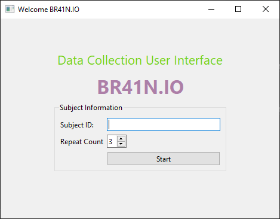
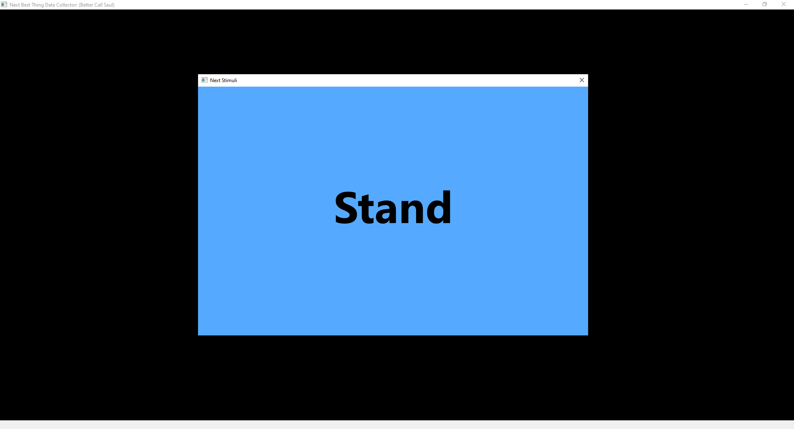
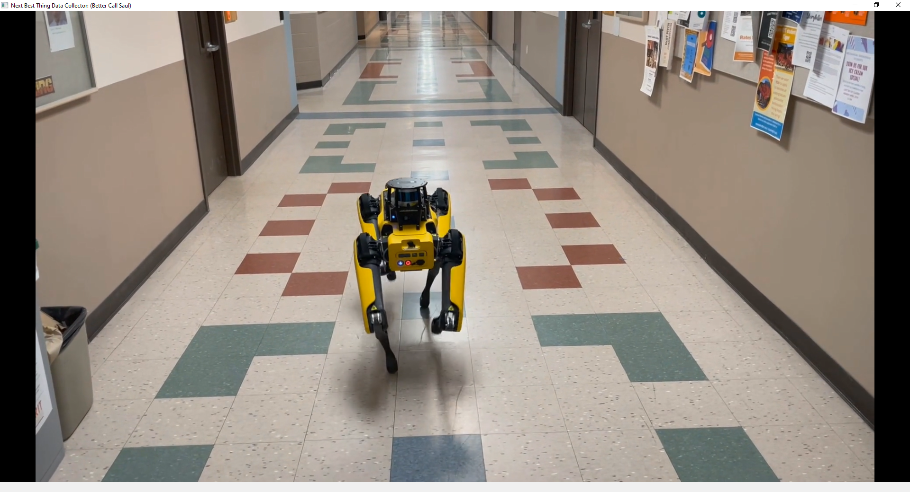
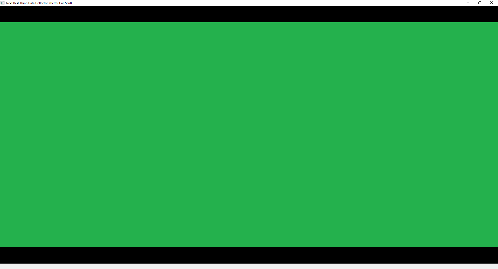

# BCI-CONTROLED-BD-SPOT-ROBOT
In this project, we collected a dataset from Unicorn Hybrid Black EEG Head Set... We use 9 discrete classes to control Boston Dynamics Spot Robot...

<p align="center">
  
  
  This is the login screen that allow user to ennter the name and how many times each video will be displayed.
</p>


<p align="center">
  
  
  
</p>

The NEXT Best Thing Datacollector (Better Call Saul!) is generating lsl stream with following settings: 
The stream always sends 0 and send the events below once as they appears then go to 0 again at 100 Hz.
```
        self.video_list = {
            'forward'   : { 'path': 'video_folder/Forward.mp4', 'id': 1 },
            'backward'  : { 'path': 'video_folder/Reverse.mp4', 'id': 2 },
            'left'      : { 'path': 'video_folder/Left.mp4', 'id': 3 },
            'right'     : { 'path': 'video_folder/Right.mp4', 'id': 4 },
            'turn right': { 'path': 'video_folder/RotateRight.mp4', 'id': 5 },
            'turn left' : { 'path': 'video_folder/RotateLeft.mp4', 'id': 6 },
            'stand'     : { 'path': 'video_folder/Stand.mp4', 'id': 7 },
            'sit'       : { 'path': 'video_folder/Sit.mp4', 'id': 8 },
            'transition': { 'path': 'video_folder/GreenScreen.mp4', 'id' : 9}
            'nothing'   : { 'path': 'video_folder/Nothing.mp4', 'id': 10 },
        }
```
